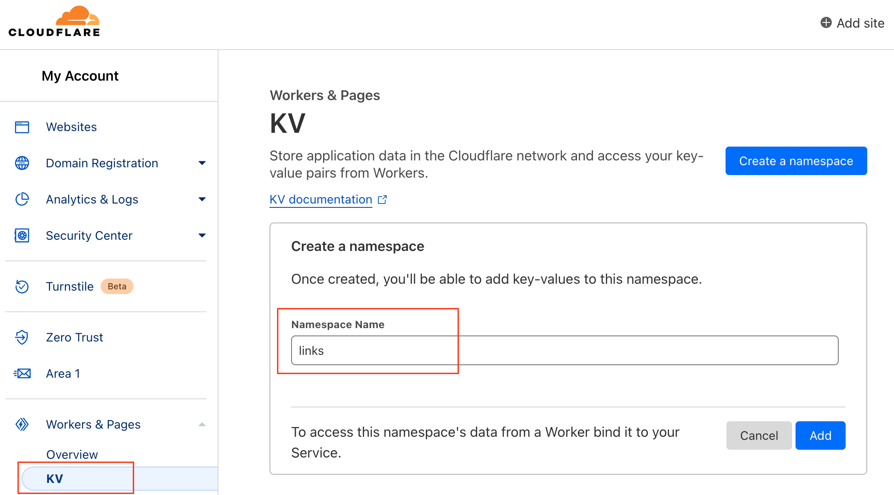
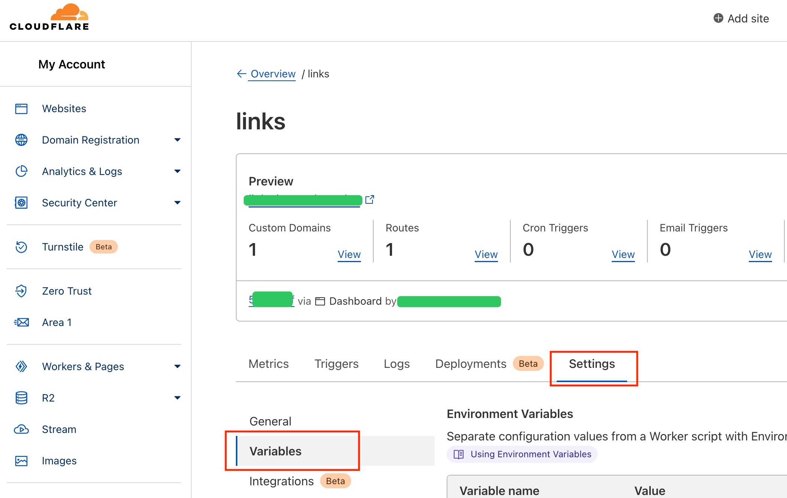
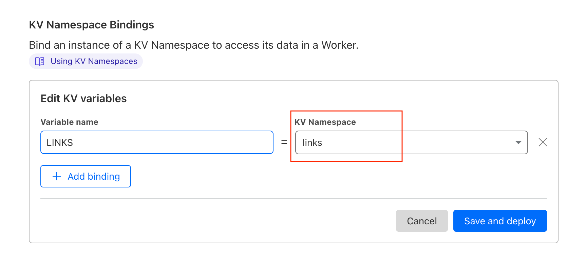

# Url-Shorten-Worker
A URL Shortener created using Cloudflare Worker

# API

[API Documentation (API文档)](docs/API.md)

# Getting start
### 去Workers KV中创建一个命名空间

Go to Workers KV and create a namespace.

### 去Worker的Settings选选项卡中绑定KV Namespace

Bind an instance of a KV Namespace to access its data in a Worker.

### 其中Variable name填写`LINKS`, KV namespace 选择你刚刚创建的命名空间

Where Variable name should set as `LINKS` and KV namespace is the namespace you just created in the first step.

### 复制本项目中的`index.js`的代码到Cloudflare Worker 

Copy the `index.js` code from this project to Cloudflare Worker. 

### 点击Save and Deploy

Click Save and Deploy

# Demo
https://lnks.eu.org/

Note: Because someone abuse this demo website, all the generated link will automatically expired after 24 hours. For long-term use, please deploy your own.

注意：所有由Demo网站生成的链接24小时后会自动失效，如需长期使用请自行搭建。

# crazypeace 修改版

https://github.com/xyTom/Url-Shorten-Worker/tree/crazypeace

支持功能：1、自定义短链 2、页面缓存设置过的短链 3、长链接文本框预搜索localStorage 4、增加删除某条短链的按钮 5、密码保护
